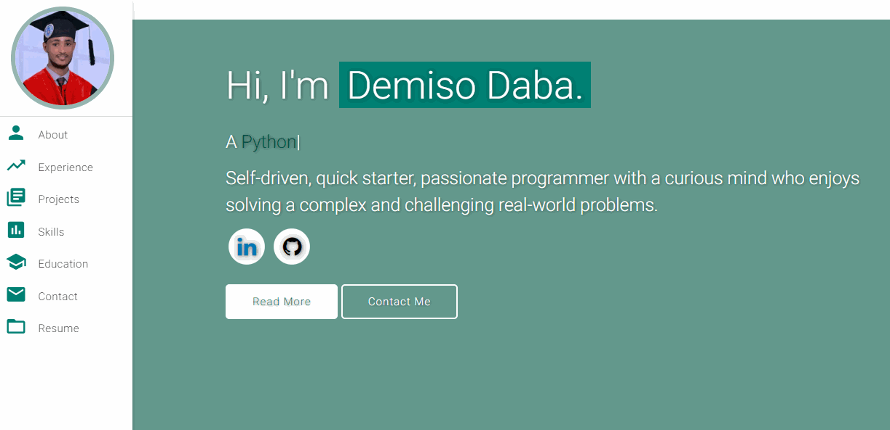

# Welcome to My Personal Portfolio! 🚀

> ## Descriptions
> This repository contains a version of SE Foundations portifolio, requested by [Alx-Africa School](https://www.alxafrica.com/) in partial fullfilment for Foundations, done by [Demiso Daba](https://github.com/DemisoDaba/)

### 🌟 Take a Glimpse

 
  <kbd>
    
  </kbd>

⭐ Don't forget to star this repository on GitHub—it truly makes a difference!

---

## Features 📋
⚡️ **Fully Responsive**\
⚡️ **Valid HTML5 & CSS3**\
⚡️ **Integrate Typing Animation with `Typed.js`**\
⚡️ **Highly Customizable**

---

## Get Started 🚀
1. Clone the repository.
2. Tailor the content in <b>index.html</b> to suit your needs.
3. Customize images in `DemisoDaba.github.io/assets/img/` according to your preferences.
4. Utilize [Github Pages](https://create-react-app.dev/docs/deployment/#github-pages) for hassle-free deployment.
5. Create a GitHub repository named `<your-github-username>.github.io`.
6. Push the modified code to the `master` branch of this repository.
7. <b>NOTE:</b> Set `analyticsId` from your Google Analytics account within the Google Analytics script tag if using your own.

---

## Sections 📚
✔️ **About Me**\
✔️ **Experience**\
✔️ **Projects** \
✔️ **Skills** \
✔️ **Education**\
✔️ **Contact Info**\
✔️ **Resume**

Experience it live: **[Click Here](https://DemisoDaba.github.io/)**

---

## Tools Used 🛠️
* [<b>GitHub Pages</b>](https://create-react-app.dev/docs/deployment/#github-pages) - Host static website (HTML, CSS, JS).
* [<b>Materialize</b>](https://materializecss.com/) - CSS framework for Google's Material Design components.
* [<b>Typed.js</b>](https://mattboldt.com/demos/typed-js/) - JavaScript Library

---

## Contributing 💡
1. **Option 1**
    - 🍴 Fork this repo!

2. **Option 2**
    - 👯 Clone this repo to your local machine.

3. **Craft your magic** 🔨🔨🔨

4. **Create a new pull request.**

---

## License 📄
This project is licensed under the MIT License - see the [LICENSE.md](./LICENSE) file for details.
